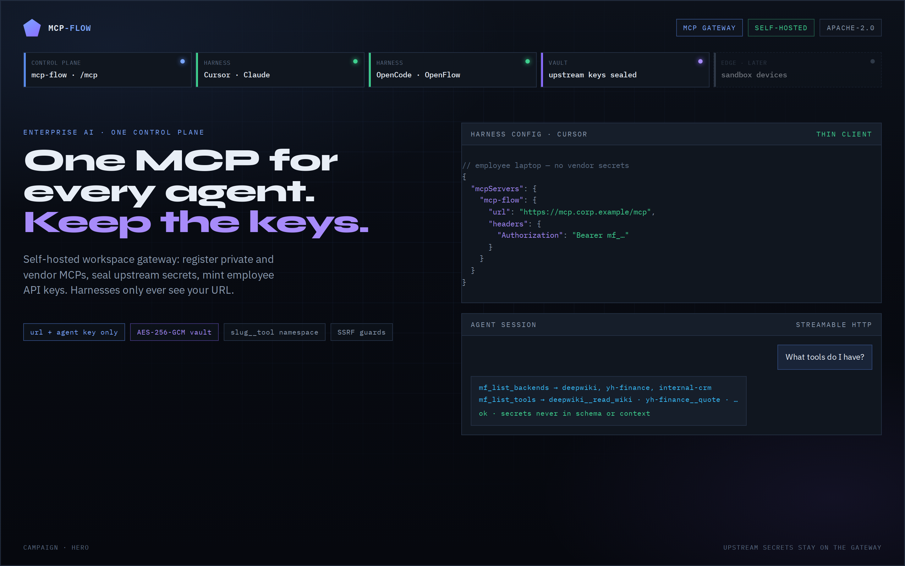
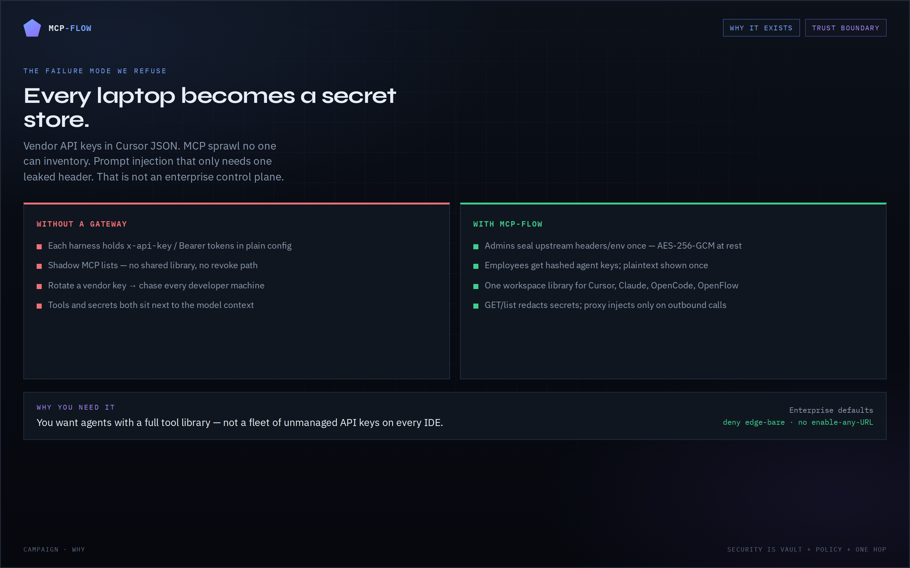
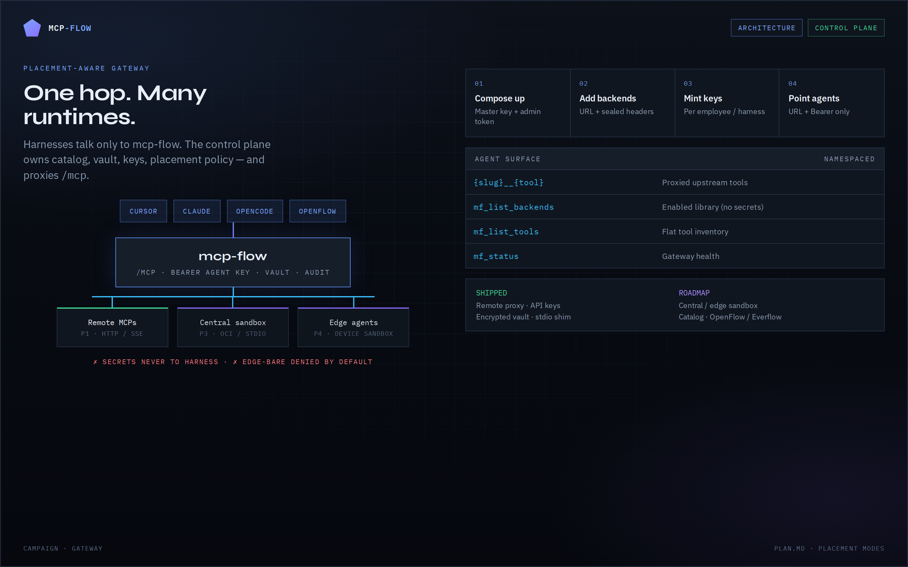
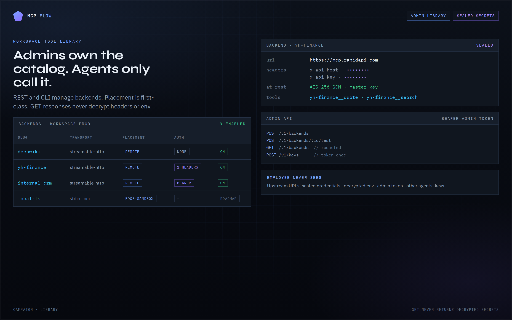
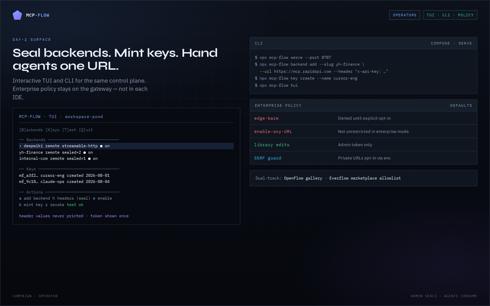

# mcp-flow

**One MCP endpoint for every AI harness — upstream secrets stay on the gateway.**

Self-hosted **workspace MCP gateway**: register private and vendor MCP servers, store env/API keys encrypted, mint agent API keys, and share the same tool library across Cursor, Claude, OpenCode, OpenFlow assistants, and more. Optional **central or edge** runtimes run installable MCPs in a **sandbox** (or bare, if you opt in).



Also dual-tracked as a **registry catalog** for [OpenFlow](https://github.com/real-limitless/OpenFlow) (one-node gallery) and [ProjectEverflow](https://github.com/real-limitless/ProjectEverflow) (marketplace MCP tab).

[PLAN.md](./PLAN.md) · [Campaign storyboard](docs/campaign/) · [Issues](https://github.com/real-limitless/mcp-flow/issues) · Apache-2.0

## Visual tour

| | |
| :---: | :---: |
| **Why it exists** | **Gateway architecture** |
|  |  |
| **Admin library** | **Operators** |
|  |  |

Screenshots live in [`docs/images/campaign-*.png`](docs/images/). Re-shoot from [`docs/campaign/`](docs/campaign/) with `./capture.sh`.

---

## Why this exists

Every IDE holding vendor API keys is not a control plane. MCP sprawl with no revoke path is not enterprise policy.


**You need this when:**

- Platform admins must own the tool library; employees only get a URL + agent key
- Upstream secrets must stay sealed on the gateway — never in harness config or model context
- Cursor, Claude, OpenCode, and OpenFlow should share one workspace library
- Enterprise defaults matter: deny edge-bare, no unrestricted enable-any-URL

---

## Status

**P1 gateway (remote proxy) implemented.** Catalog sync and edge runtimes are later phases — see [PLAN.md](./PLAN.md).

| Issue | Topic |
| --- | --- |
| [#1](https://github.com/real-limitless/mcp-flow/issues/1) | Core plan: gateway + catalog + placement |
| [#2](https://github.com/real-limitless/mcp-flow/issues/2) | Everflow / OpenFlow catalog consumer contract |
| [#3](https://github.com/real-limitless/mcp-flow/issues/3) | Edge agent + multi-device sandbox/bare |

## Quickstart

Requirements: **Node.js ≥ 22**.

```bash
cp .env.example .env
# set MCP_FLOW_MASTER_KEY and MCP_FLOW_ADMIN_TOKEN
openssl rand -base64 32   # master key
openssl rand -hex 32      # admin token

npm install
npm run build

export $(grep -v '^#' .env | xargs)
npx mcp-flow serve --port 8787
```

### TUI (manage upstream MCPs)

```bash
npx mcp-flow tui
```

Interactive terminal UI: list/add/enable/disable/test/delete backends, seal auth headers, mint/revoke agent API keys. Arrow keys + enter; `q` quits.

### Mint an agent key

```bash
npx mcp-flow key create --name cursor
# → { "key": { "token": "mf_…", "prefix": "mf_…", … } }  # secret shown once
```

### Operator key (AI manages the gateway)

Mint a key with `scopes.admin` so an agent can call **`mf_admin_*`** tools on `/mcp` (and the same token works on `/v1/*` REST). Env `MCP_FLOW_ADMIN_TOKEN` remains break-glass for humans/UI.

```bash
npx mcp-flow key create --name openflow-ops --admin
# Point the harness at http://127.0.0.1:8787/mcp with that mf_* token.
```

Examples of operator tools: `mf_admin_status`, `mf_admin_create_backend`, `mf_admin_create_key`,
`mf_admin_list_audit`, `mf_admin_catalog_install`, devices/policy helpers. Normal agent keys never see these tools.

Prefer operator keys over pasting the env admin token into IDE config (revocable, audited by key id).

### Projects (per-chat tool collections)

One agent key can span multiple **projects** — named sets of backends. Agents switch with MCP tools:

```text
mf_list_projects → mf_use_project({ project: "webdevelopment" }) → tools/list
```

- **`default`** project is auto-created and gains new backends automatically.
- `mf_use_project` binds the chat (session sticky) and returns an optional **`mf_sess_*` session token** for project-scoped calls.
- Admin UI → **Projects** tab, or `GET/POST /v1/projects`.

### Add a remote MCP (headers sealed)

```bash
npx mcp-flow backend add \
  --slug deepwiki \
  --url https://mcp.deepwiki.com/mcp \
  --transport streamable-http \
  --enable

# Multiple sealed headers (repeat --header). Name=value or Name: value:
npx mcp-flow backend add \
  --slug yh-finance \
  --url https://mcp.rapidapi.com \
  --header "x-api-host: yahoo-finance15.p.rapidapi.com" \
  --header "x-api-key: YOUR_RAPIDAPI_KEY" \
  --enable

# Merge more headers later (does not wipe existing):
npx mcp-flow backend headers yh-finance \
  --header "Authorization=Bearer …"

# List header *names* only (values never printed):
npx mcp-flow backend headers yh-finance
```

You do **not** need `npx mcp-remote … --header` in the harness — put the URL + headers on the backend; harnesses only get the mcp-flow URL + agent key.

### Point a harness at mcp-flow only

HTTP (Cursor / clients with streamable HTTP):

```json
{
  "mcpServers": {
    "mcp-flow": {
      "url": "http://127.0.0.1:8787/mcp",
      "headers": {
        "Authorization": "Bearer mf_YOUR_AGENT_KEY"
      }
    }
  }
}
```

Stdio shim:

```bash
MCP_FLOW_URL=http://127.0.0.1:8787/mcp MCP_FLOW_API_KEY=mf_… npx mcp-flow stdio
```

Tools appear as `{slug}__{tool}` plus meta tools `mf_list_backends`, `mf_list_tools`, `mf_status`.

### Docker Compose

```bash
docker compose up --build -d
docker compose logs -f bootstrap   # wait until it writes /data/mcp-client.json
```

Secrets are generated into the `mcp-flow-data` volume if `.env` is empty.

| | |
| --- | --- |
| **MCP (agents)** | `http://127.0.0.1:8787/mcp` (container port **8787**, `expose` only — map a domain in Dokploy/Traefik) |
| **Admin UI** | `http://127.0.0.1:8787/admin/` |
| **Health** | `http://127.0.0.1:8787/health` |
| **Agent key + client JSON** | `docker compose exec mcp-flow cat /data/mcp-client.json` |
| **Admin token** | `docker compose exec mcp-flow cat /data/admin.token` |

Point Cursor / Claude / OpenCode at the `mcpServers` block in that JSON. The compose **edge** agent starts with the stack (device `compose-edge` should show **online**). Central-sandbox OCI: uncomment the docker.sock volume in `docker-compose.yml`.

Tailnet (Headscale or Tailscale): set `TS_AUTHKEY`, `TS_HOSTNAME`, and `TS_LOGIN_SERVER` in `.env`. The sidecar starts with the stack (userspace, no TUN — Dokploy-safe) and TCP-forwards `:8787` to the gateway. MCP is `http://<TS_HOSTNAME>:8787/mcp` on the tailnet.

### Admin REST

All `/v1/*` routes require `Authorization: Bearer $MCP_FLOW_ADMIN_TOKEN`.

| Method | Path | Notes |
| --- | --- | --- |
| `POST` | `/v1/keys` | Mint agent key (token once) |
| `GET` | `/v1/keys` | List keys (no secrets) |
| `DELETE` | `/v1/keys/:id` | Revoke |
| `POST` | `/v1/backends` | Create (GET redacts sealed headers/env) |
| `GET` | `/v1/backends` | List (redacted) |
| `PATCH` | `/v1/backends/:id` | Update / enable |
| `POST` | `/v1/backends/:id/test` | Upstream tools/list smoke |
| `GET/PATCH` | `/v1/workspace`, `/v1/workspace/policy` | Workspace + edge-bare policy |
| `GET/POST/DELETE` | `/v1/devices` | Edge device enroll / list / revoke |
| `WS` | `/v1/edge/connect` | Edge agent (device token) |
| `GET` | `/admin/` | Operator admin UI |
| `ALL` | `/mcp` | Agent MCP (API key) |

## Security

- Upstream headers/env encrypted at rest (`AES-256-GCM` + `MCP_FLOW_MASTER_KEY`)
- Agent keys stored as SHA-256 hashes; plaintext shown once
- GET payloads never include decrypted secrets
- SSRF guards on backend URLs (`MCP_FLOW_ALLOW_PRIVATE_URLS=true` to allow LAN)
- Placement: `remote`, `central-sandbox`, `edge-sandbox`, `edge-bare` (bare needs workspace policy)
- Admin UI at `/admin/` (browser holds admin token in sessionStorage)

## Placement (P3–P6)

```bash
# Central stdio / OCI
npx mcp-flow backend add --slug local --transport stdio \
  --command npx --command -y --command some-mcp --enable
npx mcp-flow backend add --slug boxed --transport oci --image ghcr.io/example/mcp:latest

# Edge device
npx mcp-flow device enroll -n laptop
npx mcp-flow edge --url http://127.0.0.1:8787 --token <device-token>
npx mcp-flow backend add --slug on-laptop --transport stdio \
  --command npx --command -y --command some-mcp \
  --placement edge-sandbox --device-id <dev_id> --enable

# Bare (opt-in)
npx mcp-flow workspace policy --allow-edge-bare true
```

Catalog install maps npm/pypi/oci packages to `central-sandbox` when no remote URL.

## Catalog (P1b)

```bash
npm run catalog:sync          # → catalog/entries/*.json + index.json
npx mcp-flow catalog search github
npx mcp-flow catalog show 'io.github…/name' --pretty
npx mcp-flow catalog enrich 'io.github…/name' --pretty   # README + tools/list
npx mcp-flow catalog install 'io.github…/name' --enable
# factory bulk enrich:
npm run factory:scrape -- --enqueue && npm run factory:worker
```

Stable allowlist id = registry `server.name`. Schema: `catalog/schema.json` (v1.0.0).  
Each server is **one JSON file** under `catalog/entries/` (plus slim `index.json`). See [catalog/README.md](./catalog/README.md).

### Catalog factory TUI (queue + proxies)

Like ansible-flow-mcp’s Galaxy factory — multi-pane scrape → queue → worker, with SOCKS/HTTP proxy pool:

```bash
npm run factory:tui
# headless:
npm run factory:scrape -- --max-pages 5 --enqueue
npm run factory:worker -- --once
```

See [scripts/factory/README.md](./scripts/factory/README.md).

## Scopes + audit (P2)

```bash
npx mcp-flow key create -n intern --scope-prefix yh-finance__ --scope-prefix mf_
npx mcp-flow key scopes <id> --scope-prefix demo__
npx mcp-flow audit --limit 20
npx mcp-flow doctor
```

Scoped keys only see/call matching tool name prefixes (`mf_status` always allowed).

Tool-call audit rows store **redacted request arguments** and **response bodies** (size-capped; secrets scrubbed). Treat the SQLite DB as sensitive. Cap via `MCP_FLOW_AUDIT_MAX_DETAIL_BYTES`.

## Development

```bash
npm test
npm run typecheck
npm run catalog:validate

# Static catalog site (campaign UI + JSON shards)
SITE_BASE= npm run site:build   # → site/out/ (+ catalog/)
npx serve site/out              # open http://localhost:3000
# Live: https://real-limitless.github.io/mcp-flow/
npm run dev   # tsx src/cli.ts serve
```

## Architecture

```text
AI harnesses  ──HTTP or stdio shim──►  mcp-flow /mcp  (API key)
                                            │
                    ┌───────────────────────┼───────────────────────┐
                    ▼                       ▼                       ▼
              Remote MCPs            Central sandbox           Edge agents
              (P1)                   (P3)                      (P4–P5 / #3)
```

## License

Apache-2.0
